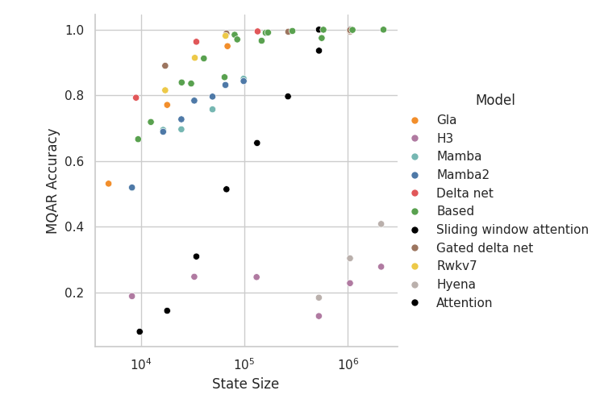

## On Baselines in LLM Architecture Research, a Tale of DeltaNet and RWKV-7

A few days ago I saw this curious chart from Songlin of DeltaNet:


which is strange, because we have this in RWKV-7 paper:


Our code is at https://github.com/Triang-jyed-driung/zoology-rwkv and the average MQAR accuracy for RWKV-7 is **0.94+ for state dim 8k, and 0.99+ for size dim 16k**.

So I checked HazyResearch/zoology repo and found a few issues.

Firstly, the state size of RWKV-7 was incorrectly computed, exaggerated to 4x for d_model=128, and 16x for d_model=256.

The correct state size formula **(num_heads * head_k_dim * head_v_dim)** is the same for RWKV-7 and DeltaNet, but a wrong formula (num_heads * k_dim * v_dim) was used for RWKV-7.

Fortunately the kind zoology folks fixed it soon:


Now the yellow RWKV-7 points look a bit better (if you were using zoology to compare RWKV-7, please remember to correct your results, thank you!):


For example, this is from the recent ATLAS (2505.23735) paper, and the green RWKV-7 points were incorrectly positioned (the exact setup of the paper is not known, so this is an illustration):


The second major issue is, a short-conv of length 4 is highly beneficial for grokking this toy MQAR task (but NOT for real language modeling), and it's given to all other arch, except RWKV-7, which is using its default token-shift (similar to a short-conv of length 2), **putting it at an unfair disadvantage**.

From zoology readme:


And there are known issues with current RWKV-7 implementation (including kernel precision) in FLA repo (everyone is working on fixing these, but it takes time, so please use RWKV-LM kernel before that) used by zoology repo.

So I do the simplest thing: I simply **replace the DeltaNet kernel in zoology delta_net.py by RWKV-7 kernel (from RWKV-LM repo)**, because the DeltaNet implementation in zoology is considered great, and this will be the most direct apples-to-apples comparison.

Let's review the formulas, for a single head.

This is DeltaNet kernel where βt are scalars:


This is GatedDeltaNet kernel where αt and βt are scalars:


This is RWKV-7 kernel where w/a/b/v/k are general vectors:


The RWKV-7 kernel is **strictly more expressive** (note it's not following vanilla delta rule - we called it **generalized delta rule** in RWKV-7 paper), which is reflected in performances of various tasks.

As a starting point, we can allow β to be vectors, and use RWKV-7 kernel with w = 1, a = -βk, b = k, v = βv, k = k, to get BetterDeltaNet.

Let's compare [BetterDeltaNet using RWKV-7 kernel (black)] vs [DeltaNet (color)] on the most difficult MQAR task (8192 state sz, 256 kv pairs):

| loss | accuracy |
| ---- | ---- |
|  | LR 1e-3, BDN-acc-256 = 12.92 ± 0.00%, DN-acc-256 = 8.88 ± 0.19% |
|  | LR 3e-3, BDN-acc-256 = 14.31 ± 0.07 %, DN-acc-256 = 11.46 ± 0.14 % |
|  | LR 1e-2, BDN-acc-256 = 12.84 ± 0.36 %, DN-acc-256 = 11.62 ± 0.10 % |
|  | LR 3e-2, BDN-acc-256 = 13.67 ± 0.48 %, DN-acc-256 = 12.78 ± 1.35 % |
|  | LR 4.6e-2 (this is the highest stable LR for DN in this setup), DN-acc-256 = 13.09 ± 0.67 % |

14.31 ± 0.07% vs 13.09 ± 0.67%. BetterDeltaNet with RWKV-7 kernel wins.

There are plenty of further improvements in RWKV-7, and here I show a simple replacement of DeltaNet by RWKV-7 kernel (without adding further improvements from RWKV-7) is enough to boost performance, as it should be, because as I said, the RWKV-7 kernel is **strictly more expressive**.

How to run it (requires 1 GPU with 16G VRAM):

```bash
git clone https://github.com/BlinkDL/zoology
cd zoology
pip install --no-use-pep517 flash-linear-attention
pip install -e .[extra,analysis]

# change logger entity in zoology/experiments/030325_new_arch/configs.py to your wandb acc first

python -m zoology.launch zoology/experiments/030325_new_arch/configs.py
```

### Conclusion:

It can be hard to produce correct baselines. I notice the transformer baseline is usually badly trained in most "new LLM arch" paper too.

Please use https://github.com/BlinkDL/RWKV-LM/tree/main/RWKV-v7/train_temp as starting point if you'd like to compare RWKV-7. Thank you.

# Original README

<div align="center" >
     

[](https://img.shields.io/github/license/HazyResearch/meerkat)
[](https://github.com/pre-commit/pre-commit)

**Understand and test language model architectures on synthetic tasks.**


</div>

Zoology provides machine learning researchers with a simple playground for understanding and testing language model architectures on synthetic tasks. This repository can be used to reproduce the results in our paper *[Zoology: Measuring and Improving Recall in Efficient Language Models](https://arxiv.org/abs/2312.04927)*. See the section on [reproducing paper experiments](#reproducing-paper-experiments) for details.

---

*Why did we make Zoology?* In our research on efficient language models, synthetic tasks have been crucial for understanding and debugging issues before scaling up to expensive pretraining runs. So, we're releasing the code we've used alongside instructions for replicating a lot of our experiments and their WandB logs.  Simplicity is our main design goal: limited dependencies, architecture implementations that are easy to understand, and a straightforward process for adding new synthetic tasks. 

*Is Zoology a good fit for your use case?* If you are looking to actually train a large machine learning model, Zoology's training harness (which is optimized for simplicity) is certainly not a good fit. For our language model research, we've found the [GPT-NeoX](https://github.com/EleutherAI/gpt-neox) useful for this. That being said, you might still want to use some of Zoology's layer implementations or maybe even mix the synthetic tasks into your training distribution. 

*I want to explore the Based architecture. How should I get started?* See our repository at [HazyResearch/based](https://github.com/HazyResearch/based) for the code we used to train and evaluate large Based language models. If you would like to reproduce the synthetic experiments from the Based paper, this is the right repository! See [zoology/experiments/arxiv24_based_figure2/README.md]() for instructions on how to reproduce the results. 

## Models

We have provided support for various efficient models. 

| Year | Venue   | Model          | Title   |  Paper   |   
| :--- | :------ | :------------- | :-------------------------------------------------------------------------------------------------------- | :------------------------------------------------: | 
| Oct 2021  | NeurIPS    | Scatterbrain   | Scatterbrain: Unifying Sparse and Low-rank Attention Approximation           |  [link](https://arxiv.org/abs/2110.15343)    |
| Jan 2023  | ICLR       | H3             | Hungry Hungry Hippos: Towards Language Modeling with State Space Models      |  [link](https://arxiv.org/abs/2212.14052)    |
| Feb 2023  | ICLR       | Hyena          | Hyena Hierarchy: Towards Larger Convolutional Language Models                |  [link](https://arxiv.org/abs/2302.10866)    |
| July 2023  | ICLR       | RetNet         | Retentive Network: A Successor to Transformer for Large Language Models                |  [link](https://arxiv.org/abs/2307.08621)    |
| Dec 2023  | ICLR       | Input-dependent sparse attention          | Zoology: Measuring and Improving Recall in Efficient Language Models         |      [link](https://arxiv.org/abs/2312.04927)         |
| Dec 2023  | COLM       | Mamba          | Mamba: Linear-Time Sequence Modeling with Selective State Spaces             |  [link](https://arxiv.org/abs/2312.00752)         |
| Dec 2023  | ICML       | GLA            | Gated Linear Attention Transformers with Hardware-Efficient Training         |  [link](https://arxiv.org/abs/2312.06635)    |
| Dec 2023  | ICML       | Based          | Simple linear attention language models balance the recall-throughput tradeoff   |      [link](https://arxiv.org/abs/2402.18668)         |
| June 2024 | ICML       | Mamba2         | Transformers are SSMs: Generalized Models and Efficient Algorithms Through Structured State Space Duality |      [link](https://arxiv.org/abs/2405.21060)       |
| June 2024 | NeurIPS    | DeltaNet       | Parallelizing Linear Transformers with Delta Rule  over Sequence Length      |      [link](https://arxiv.org/abs/2406.06484)   |
| Dec 2024  | ICLR       | Gated DeltaNet | Gated Delta Networks: Improving Mamba2 with Delta Rule                       |      [link](https://arxiv.org/abs/2412.06464)   |
| Feb 2025  | ArXiv      | DeepSeek Native sparse attention   | Native Sparse Attention: Hardware-Aligned and Natively Trainable Sparse Attention | [link](https://arxiv.org/pdf/2502.11089)   | 
| Mar 2025  | ArXiv      |  RWKV7         |    RWKV-7 "Goose" with Expressive Dynamic State Evolution                    |      [link](https://arxiv.org/abs/2503.14456)    | 

<div align="center" >
    
</div> 

**Notes:** 
1. State size is a *proxy* for model efficiency, however it is also worth considering the wall-clock speed required to use different state sizes for a particular architecture choice. 
2. We give the *BASED* recipe to these architectures, where we hybridize the sequence mixer with a short convolution, for fair comparison. Pre-BASED linear attention architectures like RetNet, GLA typically did not use short convolutions/short local mixers.
3. MQAR is a useful but simplistic synthetic. We wholeheartedly welcome contributions for new synthetics (MQAR variants) that test additional skills -- feel free to make a PR or email us!

## Getting started

**Installation.** First, ensure you have torch and transformers installed. You can install torch using the following the instructions [here](https://pytorch.org/get-started/locally/). Then, install Zoology with:
 
```bash
git clone https://github.com/HazyResearch/zoology.git
cd zoology
pip install -e .[extra,analysis] 
```
If you want to keep this install as lightweight as possible; the only required dependencies are: `torch, einops, tqdm, pydantic, wandb`. The ``mamba_ssm, conv1d`` installs are often problematic. There is some extra functionality (*e.g.* launching sweeps in parallel with Ray) that require additional dependencies. To install without the optional dependencies, run `pip install -e .`.

Observations: 
- The ```fla``` module (imported for GLA, RWKV-v7, etc.) is most compatible with Python 3.10+ Further, if you use an H100 GPU and incur issues with triton, you may find this issue helpful: [issue](https://github.com/fla-org/flash-linear-attention/issues/196).
- The ```mamba_ssm``` module (imported for Mamba) is most compatible with PyTorch 2.5

Then, try running an example experiment with: 
```
python -m zoology.launch zoology/experiments/examples/basic.py
```
This will train a simple two layer transformer on multi-query associative recall. To run a sweep over learning rates, try: 
```
python -m zoology.launch zoology/experiments/examples/basic_sweep.py
```
If you have access to multiple GPUs, you can run the sweep in parallel by adding the `-p` flag.


## Reproducing paper experiments
This repository has been used to produce results in a few papers on efficient language models. 
The configs, instructions and plotting code for reproducing the figures in these papers are provided in the following sub-folders. 

- [Zoology: Measuring and improving recall in efficient language models](https://arxiv.org/abs/2312.04927)
    - zoology/experiments/iclr24_zoology_figure2
- [Based: Simple linear attention balances the recall-throughput tradeoff]()
    - zoology/experiments/arxiv24_based_figure2
    - zoology/experiments/arxiv24_based_figure3

## Configuration, Experiments, and Sweeps
In this section, we'll walk through how to configure an experiment and launch sweeps. 

*Configuration*. Models, data, and training are controlled by configuration objects. For details on available configuration fields, see the configuration definition in [`zoology/config.py`](zoology/config.py). The configuration is a nested Pydantic model, which can be instantiated as follows:
```python
from zoology.config import TrainConfig, ModelConfig, DataConfig, ModuleConfig, FunctionConfig
from zoology.data.associative_recall import MQARConfig

input_seq_len = 10

config = TrainConfig(
    max_epochs=20,
    data=DataConfig(
        train_configs=[MQARConfig(num_examples=10_000, vocab_size=128, input_seq_len=input_seq_len, )], #**factory_kwargs
        test_configs=[MQARConfig(num_examples=1_000, vocab_size=128, input_seq_len=input_seq_len, )], #**factory_kwargs
    ),
    model=ModelConfig(
        vocab_size=128,
        sequence_mixer=ModuleConfig(name= "zoology.mixers.attention.MHA") ),
)
```
Note that the `FunctionConfig` and `ModuleConfig` are special objects that configure partial functions and PyTorch modules, respectively. 
They both have an `instantiate()` method that will import the function or class passed to `name` and partial or instantiate it with `kwargs`.
For example, 
```python
fn_config = FunctionConfig(name="torch.sort", kwargs={"descending": True})
fn = fn_config.instantiate()
fn(torch.tensor([2,4,3])) # [4, 3, 2]
```

*Launching experiments.* To launch an experiment from the command line, define a configuration object in python file and store it in a global variable `configs`:
```python
config = TrainConfig(...)
configs = [config]
```
See [`zoology/experiments/examples/basic.py`](zoology/experiments/examples/basic.py) for an example. 

Then run `python -m zoology.launch zoology/experiments/examples/basic.py`, replacing `basic.py` with the path to your experiment. This will launch a single training job. 


*Launching sweeps.* To launch a sweep, simply add more configuration objects to the `configs` list. For example, here's the content of [`zoology/experiments/examples/basic_sweep.py`](zoology/experiments/examples/basic_sweep.py):
```python
import numpy as np
from zoology.config import TrainConfig

configs = []
for lr in np.logspace(-4, -2, 10):
   configs.append(TrainConfig(learning_rate=lr)) 
```
You can then run `python -m zoology.launch zoology/experiments/examples/basic_sweep.py`. This will launch a sweep with 10 jobs, one for each configuration.

*Launching sweeps in parallel.* If you have multiple GPUs on your machine, you can launch sweeps in parallel across your devices. 
To launch sweeps in parallel, you'll need to install [Ray](https://docs.ray.io/en/latest/ray-overview/installation.html): `pip install -e.[extras]`. 
Then, you can run `python -m zoology.launch zoology/experiments/basic_sweep.py -p`. 
This will run the configurations in parallel using a pool of workers, one per GPU.

*Logging.* Zoology uses [Weights and Biases](https://wandb.ai/site) for logging. You'll need to login with `wandb login` and update the `LoggerConfig` in your configuration to point to your project: 
```python
from zoology.config import TrainConfig, LoggerConfig

TrainConfig(
    logger=LoggerConfig(
        project="my_wandb_project",
        entity="my_wandb_entity",
    ),
    ...
)
```

## Data
In this section, we'll walk through how to create a new synthetic task and discuss some of the tasks that are already implemented.

*Creating a new task.* To create a new task, you'll need to subclass `zoology.config.DataSegmentConfig`. 
See zoology/data/associative_recall.py  for an example. 
```python
class DataSegmentConfig(BaseConfig):
    """
    This class should be subclassed to define per task. For example, MQARConfig
    """
    vocab_size: int = 8_192
    num_examples: int = 1_000
    input_seq_len: int = 64

    def build(self, **kwargs):
        raise NotImplementedError()
```

You'll need to implement the `build` method, which should return a `zoology.data.utils.DataSegment` object, a simple dataclass:

```python
@dataclass
class DataSegment:
    inputs: torch.Tensor
    labels: torch.Tensor
    slices: Dict[str, any] = None
```
The inputs and labels should be integer tensors with values in the range `[0, vocab_size)`. 


You can create this subclass in any file you want, as long as it's importable. Let's
assume that we've created a file `zoology/data/my_task.py` and written our `MyDataSegmentConfig` function there.
Then, we can add it to our data configuration with: 
```python
from zoology.config import TrainConfig, DataConfig, FunctionConfig
config = TrainConfig(
    DataConfig(
        train_configs=[MyDataSegmentConfig(num_examples=10_000, vocab_size=128, input_seq_len=input_seq_len, **other_kwargs)],
        test_configs=[MyDataSegmentConfig(num_examples=1_000, vocab_size=128, input_seq_len=input_seq_len, **other_kwargs)],
    ),
)
```


**Caching dataset creation.** Sometimes it's useful to cache the dataset creation process, especially if it's expensive. To do so you can pass a `cache_dir` to the `DataConfig`: `DataConfig(..., cache_dir="my_cache_dir")`.


## About 

This repo is being developed by members of the HazyResearch group. 

If you use this codebase, or otherwise found our work valuable, please cite:
```
@article{zoology2023,
  title={Zoology: Measuring and Improving Recall in Efficient Language Models},
  author={Arora, Simran and Eyuboglu, Sabri and Timalsina, Aman and Johnson, Isys and Poli, Michael and Zou, James and Rudra, Atri and Ré, Christopher},
  journal={	arXiv:2312.04927},
  year={2023}
}
```


